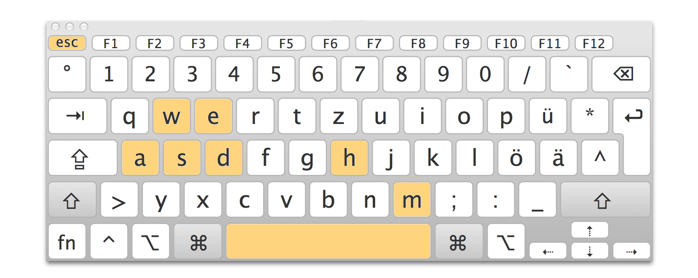
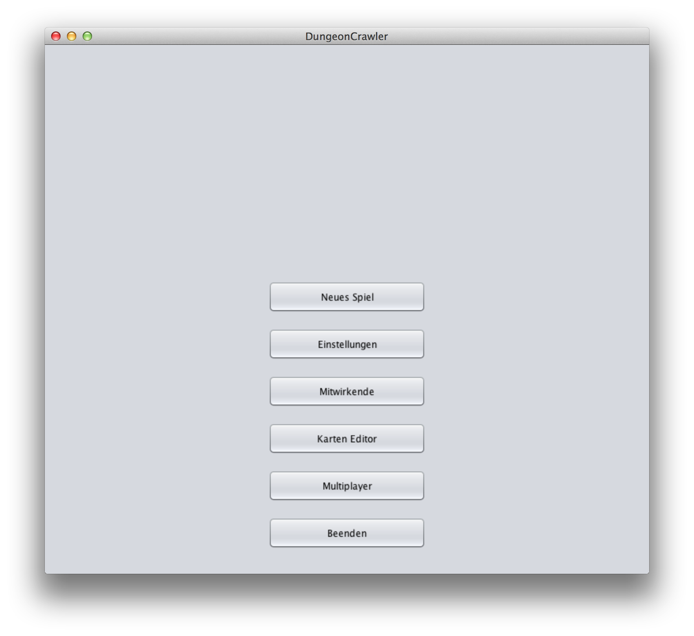
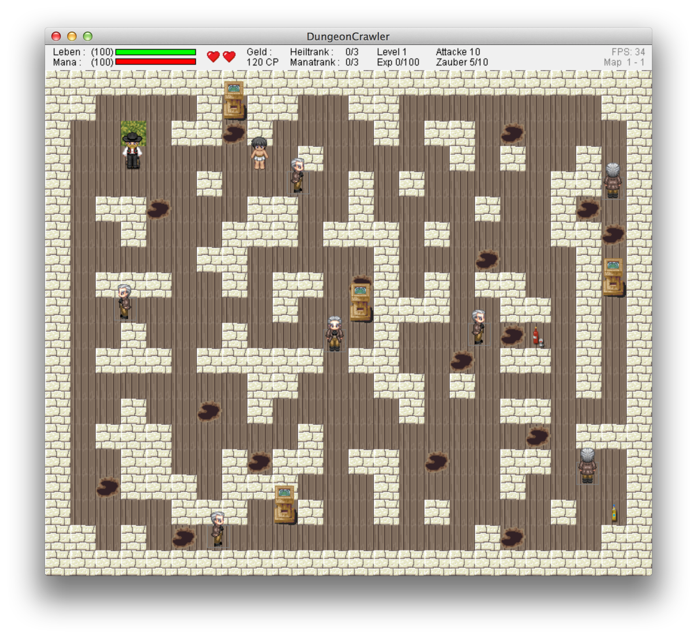
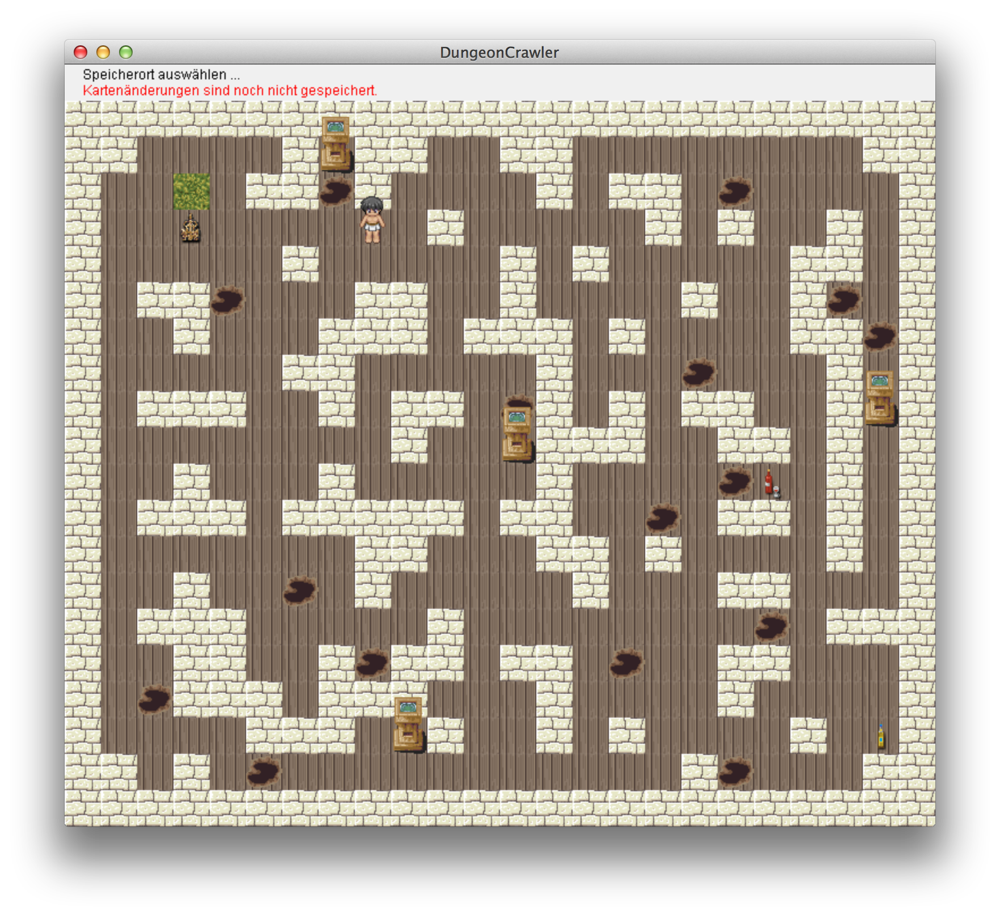
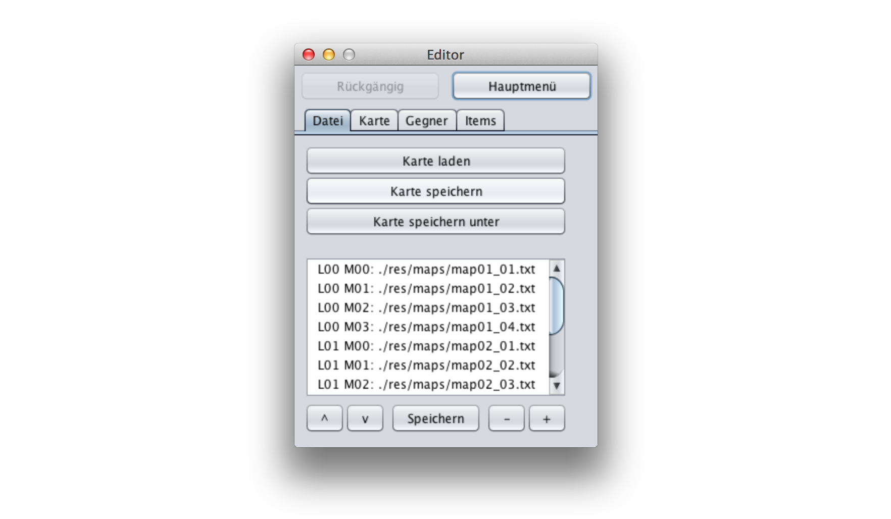
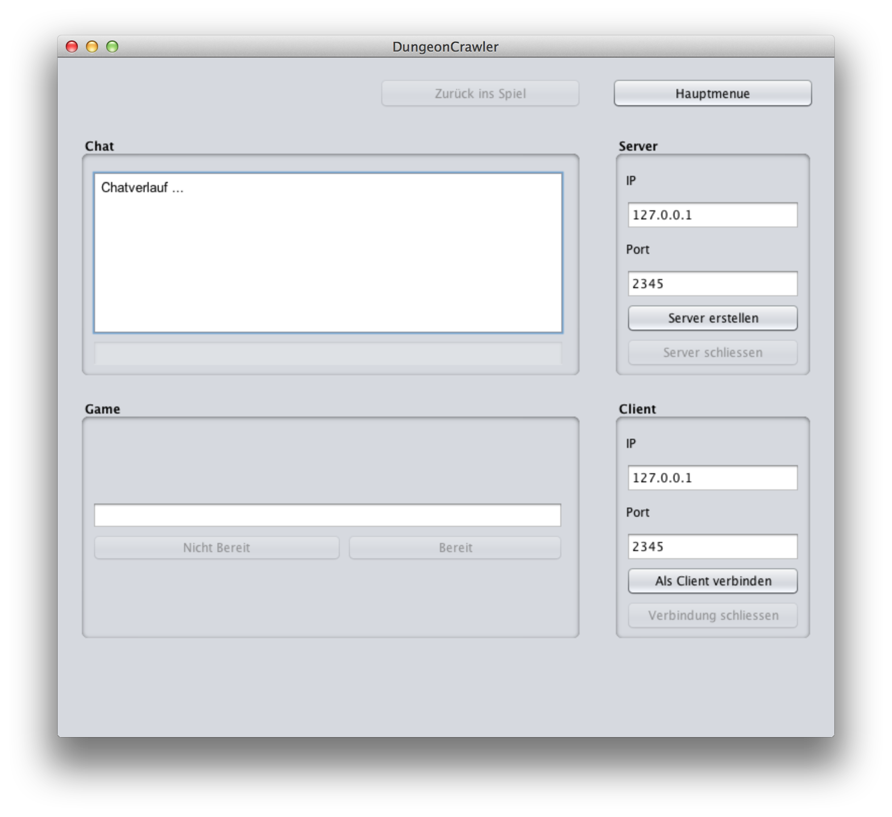

# Wir brauchen DRINGEND einen Namen - Dungeon Crawler 
---
## Inhaltsverzeichnis

- Charaktere
    - Spieler/in
    - Analysis Professor
    - Lineare Algebra Professor
    - Informatik Professor
- Gegner
    - Lebenspunkte der Gegner
- Steuerung
- Spielmenü
- Spielfenster
- Karteneditor
    - Kacheln
    - Karte laden
    - Karte speichern
    - Karte speichern unter
    - Karte in das Spiel einbauen
    - Karte aus dem Spiel entfernen
    - Reihenfolge der Karten ändern
    - neue Karte erstellen
        - Kachel einfügen/ändern
        - Item einfügen/entfernen
        - Gegner einfügen/entfernen
    - Karte ändern
        - Kachel einfügen/ändern
        - Item einfügen/entfernen
        - Gegner einfügen/entfernen
- Items
    - Manatrank
    - Heiltrank
    - Rüstung
- Aktionen
    - Interaktion mit dem NPC
    - Quests und Rätsel
    - Betreten des Shops
    - Angreifen
    - Zauber
- Schadenssystem/Erfahrung
- Multiplayer
    - Server erstellen/schließen
    - Client verbinden/trennen
    - Chat
    - Spiel starten

## Charaktere

###Spieler/in
 Ein ganz normaler Musterstudent!

###Analysis Professor
 Der Gandalf der Universität! Weise, Gutmütig, Hilfsbereit.

###Lineara Algebra Professor
 Er packt jedes Problem an der Würzel.

###Informatik Professor
 Der Superhacker.

###NPC
 Er hat hilfreiche Informationen für den Spieler.  

###Klausuraufsicht
 Er stellt die schwersten Fragen.   

##Gegner

Die Gegner haben folgende 3 Eigenschaften:  

- Fachgebiet (Analysis / Lineare Algebra / Informatik)  
- Bewegungsrichtung (horizontal / vertikal)  
- Zauberfähigkeit (vorhanden / nicht vorhanden)

Desweiteren muss man unterscheiden zwischen Gegnern und Bossgegner.  
Die Bossgegner besitzen alle die Fähigkeit zu zaubern und besitzen deutlich mehr Lebenspunkte.  

###Lebenspunkte des Gegners

**Level 1:**  
Gegner: 10 Lebenspunkte  
Bossgegner: 60 Lebenspunkte  

**Level 2:**  
Gegner: 25 Lebenspunkte  
Bossgegner: 80 Lebenspunkte  

**Level 3:**  
Gegner: 50 Lebenspunkte  
Bossgegner: 100 Lebenspunkte  

## Steuerung

**Esc:** Der Spieler gelangt in das Menü.  
**H:** Der Spieler trinkt einen Heiltrank.  
**M:** Der Spieler trinkt einen Manatrank.  
**Linke Maustaste:** Zaubern  
**Rechte Maustaste:** Zwischen Analysis-, Lineare Algebra- und InformatikZauber wechseln  

##Spielmenü

  

**Erklärung der Button:**  
*Neues Spiel:* Startet ein neues Spiel  
*Einstellungen:* Hier kann man sich zwischen Spieler und Spielerin entscheiden  
*Mitwirkende:* Hier findet man Bilder aller am Spiel mitwirkenden Personen  
*Karten Editor:* Siehe Karteneditor  
*Multiplayer:* Siehe Multiplayer  
*Beenden:* beendet das Spiel  

##Spielfenster

  
**Die Informationsleiste enthält folgende Informationen:**  
- Lebenspunkte- und Manaanzeige  
- Anzahl an Leben  
- Geld  
- Anzahl an Heil- und Manatränken  
- Erfahrungslevel und Erfahrungspunkte  
- Schaden einer Attacke  
- Schaden des Zaubers  
- aktuelle FPS  
- Karten- und Levelnummer  

##Karteneditor

  
Oben ist eine Informationsleiste die den Speicherort der aktuellen Karte enthält und anzeigt, ob Veränderungen vorgenommen wurden und ob diese bereits gespeichert wurden.  

 

###Kacheln

 Boden  
 Wand, durch die der Spieler nicht gehen kann  
 begehbare Wand, sodass man sich Geheimgänge bauen kann  
 NPC, er hilft dir im Spiel mit wertvollen Hinweisen  
 Shop, hier kannst du dir Heil- und Manatränke kaufen  
 Falle, fällt der Spieler hinein verliert er 25 Lebenspunkte und gelangt zurück zum Start  
 Start, hier startet der Spieler in der Karte  
 Ziel, erreicht der Spieler es gelangt er zur nächsten Karte  
 Rüstung, halbiert den Schaden eines Angriffes oder Zaubers  
 Heiltrank, der Spieler erhält 30 Lebenspunkte  
 Manatrank, der Spieler erhält 60 Manapunkte  

###Karte laden:  
Durch Klicken des Buttons *Karte laden* öffnet sich das Verzeichnis, indem die vorinstallierten Karten gespeichert sind. Nun wählt man das Verzeichnis aus, wo sich die Karte befindet, die man ändern möchte und wählt anschließend die zu ändernde Karte aus und bestätigt dies mit dem *Öffnen* Button. Nun wird die Karte und eine Informationsleiste angezeigt. 

###Karte speichern:
Durch Betätigen des *Karte speichern* Buttons wird die Karte unter dem Namen und Speicherort gespeichert, wie sie geöffnet wurde.  

###Karte speichern unter:
Durch Betätigen des *Karte speichern unter* Buttons öffnet sich das Verzeichnis, indem die Karten gespeichert sind. Dort gibt man seiner Karte einen beliebigen Namen und wählt einen beliebigen Speicherort für die Karte aus und klickt anschließend auf den Button *Speichern*. Gibt man der Karte einen bereits vorhandenen Namen überschreibt man die Karte. 

###Karte in das Spiel einbauen:
Betätige den *+* Button, dann öffnet sich das Kartenverzeichnis, wo man die einzufügende Karte auswählt und mit *Speichern* bestätigt. Die Karte wird als letzte Karte ins Spiel eingebaut. Nun muss man die Reihenfolge der Karten mit *Speichern* bestätigen. Anschließend muss man die Level- und Kartennummer der Karte noch ändern, indem man mit Doppelklick auf die Karte klickt und dort die korrekte Level- und Kartennummer eingibt.

###Karte aus dem Spiel enfernen:
Wähle eine Karte aus und betätige anschließend den *-* Button, um eine Karte aus dem Spiel zu entfernen. Anschließend muss man die Level- und Kartennummer der folgenden Karten noch ändern, indem man mit Doppelklick auf die Karte klickt und dort die korrekte Level- und Kartennummer eingibt.

###Reihenfolge der Karten ändern:
Wählt man eine Karte aus kann man sie anschließend mit Hilfe der *^* und *v* Buttons nach oben bzw. unten verschieben. Anschließend muss man die Level- und Kartennummer der Karte noch ändern, indem man mit Doppelklick auf die Karte klickt und dort die korrekte Level- und Kartennummer eingibt. Möchte man die Reihenfolge der Karten nun speichern klickt man auf den *Speichern*  Button.

### Neue Karte erstellen

**Kachel einfügen/ändern:** Tab *Karte* anklicken und dort per linkem Mausklick eine Kachel auswählen, die man in die Karte einbauen möchte. Nun positioniert man die ausgewählte Kachel an der gewünschten Position in der Karte mit Hilfe der linken Maustaste. Das einfügen einer Kachel kann man durch betätigen des *Rückgängig* Buttons rückgängig machen.  

**Item einfügen/entfernen:** Tab *Items* anklicken und dort per linkem Mausklick ein Item auswählen, das man in die Karte einbauen möchte. Nun positioniert man das ausgewählte Item an der gewünschten Position in der Karte mit Hilfe der linken Maustaste. Mit Hilfe von *Item entfernen*  löscht man durch Linksklick auf ein Item in der Karte das angeklickte Item.  

###Karte ändern

Zunächst lädt man die zu ändernde Karte, wie unter *Karte laden* beschrieben.  

**Kachel einfügen/ändern:** Tab *Karte* anklicken und dort per linkem Mausklick eine Kachel auswählen, die man in die Karte einbauen möchte. Nun positioniert man die ausgewählte Kachel an der gewünschten Position in der Karte mit Hilfe der linken Maustaste. Das einfügen einer Kachel kann man durch betätigen des *Rückgängig* Buttons rückgängig machen.  

**Item einfügen/entfernen:** Tab *Items* anklicken und dort per linkem Mausklick ein Item auswählen, das man in die Karte einbauen möchte. Nun positioniert man das ausgewählte Item an der gewünschten Position in der Karte mit Hilfe der linken Maustaste. Mit Hilfe von *Item entfernen*  löscht man durch Linksklick auf ein Item in der Karte das angeklickte Item.  

## Items

Die Items sind entweder im Shop zu kaufen oder befinden sich auf der Karte und können somit vom Spieler eingesammelt werden. Es gibt folgende 3 Items:

###Manatrank
Der Spieler kann maximal 3 Manatränke tragen. Verwendet er ein Manatrank füllt sich seine Mana um 60 auf, übersteigt dabei aber niemals den Wert 100.

###Heiltrank
Der Spieler kann maximal 3 Heiltränke tragen. Verwendet er ein Heiltrank füllen sich seine Lebenspunkte um 30 auf. Hat der Spieler weniger als 3 Leben und er hat mehr als 70 Lebenspunkte, dann erhält der Spieler ein Leben.

###Rüstung
Die Rüstung schütz den Spieler sowohl vor Angriffen als auch vor Zauber und halbiert den Schaden. Ein Spieler kann immer nur eine Rüstung tragen. Fällt der Spieler in eine Falle verliert er seine Rüstung.  

## Aktionen

###Interaktion mit dem NPC
Steht der Spieler unmittelbar vor einem NPC und drückt nun die Taste *E* redet er mit dem NPC und erhält von diesem wichtige Informationen für das Spiel.

###Quests und Rätsel
Steht der Spieler unmittelbar vor einer Klausuraufsicht und drückt nun die Taste *E* öffnet sich die Quest bzw das Rätsel. In dem Fenster muss man nun die richtige Antwort auf die Frage geben, damit sich das Fenster schließt. Der Spieler erhält für ein gelöstes Rätsel Erfahrungspunkte.  

###Betreten des Shops
Befindet der Spieler sich auf der Shopkachel und drückt nun die Taste *E* betritt er den Shop und kann sich dort Mana- und Heiltränke kaufen, wofür er jedoch Geld benötigt. Dies erhält er, indem er Gegner tötet. Pro getöteten Gegner erhält der Spieler 10 Euro.

###Angreifen 
Der Spieler kann den Gegner angreifen indem er *Leertaste* drückt, wenn er in seiner Nähe steht. Den Schaden eines Angriffes kann man dem Schadenssystems entnehmen.

###Zauber
Der Spieler zaubert, indem er die linke Maustaste betätigt, dabei fliegt der Zauber dahin, wo sich der Mauszieger im Moment des Klickens befindet. Pro Zauber verliert der Spieler 5 Manapunkte. Besitzt der Spieler keine Manapunkte mehr kann er nicht mehr zaubern und muss den Gegner mit Hilfe des Angriffes besiegen. Den Schaden des Zaubers kann man dem Schadenssystems entnehmen. Greift der Spieler einen Gegner mit dem Zauber eines fremden Fachgebiets an erzielt er 5 Schadenspunkte mehr, wie mit der Verwendung des Zauber aus dem Fachgebiet des Gegners.  

**Es gibt 3 Arten von Zauber:**  

 Analysis-Zauber  

 Lineare Algebra-Zauber  

 Informatik-Zauber    

##Schadenssystem/Erfahrung

Der Spieler beginnt im Erfahrungslevel 1 mit 0 Erfahrungspunkten. Den Schaden den ein Angriff bzw Zauber beim Gegner anrichtet ist abhängig vom Erfahrungslevel des Spielers. Um Erfahrungspunkte zu erhalten muss er Gegner töten. Die Anzahl der Erfahrungspunkte, die man pro getöteten Gegner erhält, staffeln sich wie folgt:

- ###Level 1:  
	**Gegner:** 15 Erfahrungspunkte  
	**Bossgegner:** 30 Erfahrungspunkte  

- ###Level 2:  
	**Gegner:** 20 Erfahrungspunkte  
	**Bossgegner:** 50 Erfahrungspunkte    
- ###Level 3:  
	**Gegner:** 30 Erfahrungspunkte  
	**Bossgegner:** 100 Erfahrungspunkte  

Der Spieler kann folgende 5 Erfahrungslevel erreichen:  

- ###Erfahrungslevel 1:  
	**Attackenschaden:** 10  
	**Magieschaden:** 5/10   
	**freigeschaltete Magien:** Analysis  
	**Aufstieg:** 100 Erfahrungspunkten  

- ###Erfahrungslevel 2:  
	**Attackenschaden:** 10  
	**Magieschaden:** 5/10   
	**freigeschaltete Magien:** Analysis, Lineare Algebra  
	**Aufstieg:** 150 Erfahrungspunkten  

- ###Erfahrungslevel 3:  
	**Attackenschaden:** 13  
	**Magieschaden:** 10/15   
	**freigeschaltete Magien:** Analysis, Lineare Algebra, Informatik  
	**Aufstieg:** 300 Erfahrungspunkten
  
- ###Erfahrungslevel 4:  
	**Attackenschaden:** 16  
	**Magieschaden:** 15/20   
	**freigeschaltete Magien:** Analysis, Lineare Algebra, Informatik  
	**Aufstieg:** 500 Erfahrungspunkten    

- ###Erfahrungslevel 5:  
	**Attackenschaden:** 19  
	**Magieschaden:**20/25   
	**freigeschaltete Magien:** Analysis, Lineare Algebra, Informatik  
	**Aufstieg:** 750 Erfahrungspunkten     
		
## Multiplayer

 

###Server erstellen/schließen
Um einen Server zu erstellen klickt man auf den Button *Server erstellen*. Nun erscheint im Chatverlauf folgende Nachricht: *"Console: Server gestartet. Auf Client warten ..."*. Hat sich ein Client mit dem Server verbunden erscheint folgende Nachricht: *"Console: Verbunden mit Client /IP:Port"* und das Chatfenster wird aktiviert, ebenso wie der Button *Bereit*. Desweiteren erhält man in der Game-Infoleiste informationen darüber, ob der Mitspieler bereit zum Spielen ist oder nicht. Möchte der Server die Verbindung zum Client trennen sendet er ihm die Nachricht *"/bye"*. Um Server zu schliessen klickt man auf den Button *Server schliessen*. Wenn der Server mit keinem Client mehr verbunden ist wird das Chatfenster und der *Bereit* Button deaktiviert.

###Client verbinden/trennen
Um sich mit einem Server zu verbinden benötigt man dessen IP und Port. Diese gibt man unter IP bzw Port ein und klickt anschließend auf den Button *Als Client verbinden*. War die Verbindung erfolgreich erscheint im Chatverlauf folgende Nachricht: *"Console: Client verbunden mit /Socketadresse"* und das Chatfenster wird aktiviert, ebenso wie der Button *Bereit*. Desweiteren erhält man in der Game-Infoleiste informationen darüber, ob der Mitspieler bereit zum Spielen ist oder nicht. Möchte man nun die Verbindung mit dem Server trennen kann man dies entweder über den Button *Verbindung schliessen* machen oder indem man die Nachricht *"/bye"* sendet. Wird der Server geschlossen wird die Verbindung vom Client mit dem Server automatisch beendet. Wenn der Client mit keinem Server mehr verbunden ist wird das Chatfenster und der *Bereit* Button deaktiviert.

###Chat
Der Chat wird aktiviert sobald der Server mit dem Client verbunden ist. Eine Ausgabe im Chatverlauf beginnt immer mit dem Autor der Nachricht gefolgt von der Nachricht selbst. Um eine eingegebene Nachricht zu senden muss man die Enter-Taste betätigen. 

###Spiel starten
Das Spiel startet automatisch sobald beide Spieler bereit sind. Der Mehrspielermodus unterscheidet sich vom normalen Spiel wiefolgt:  

- beide Spieler werden in der Karte angezeigt
- jeder Spieler hat die gleichen Gegner
- beide Spieler erreichen die nächste Karte , sobald einer von ihnen das Ziel erreicht hat
- stirbt einer von ihnen ist für beide das Spiel vorbei und sie gelangen wieder in das Chatfenster  
- erklären sie sich anschließend beide wieder bereit beginnen sie in der Karte in der einer von ihnen zuvor gestorben ist  
- durch drücken der *Esc-Taste* gelangen sie zurück zum Chatfenster  
    - nun können die Spieler miteinander chatten  
	- klickt man auf den Button *Nicht Bereit* wird das Spiel beendet  
	- klickt man auf den Button *Zurück ins Spiel* gelangt man zurück ins Spiel und kann weiterspielen
